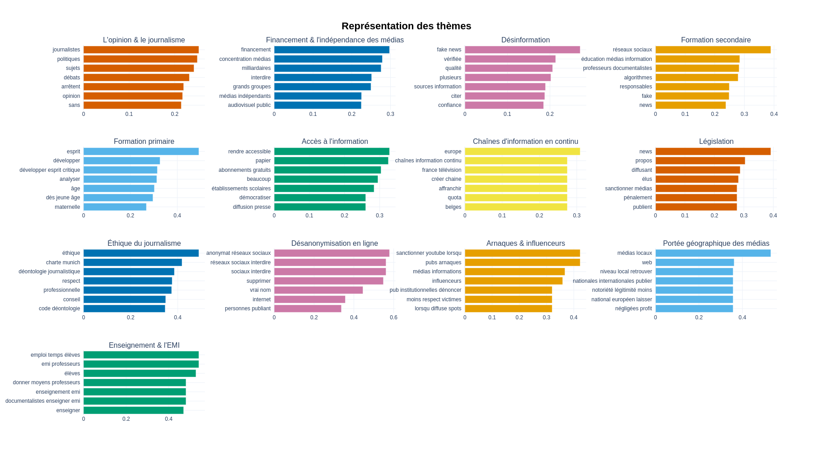

# Rapport de l'analyse

## Rédaction en HTML

Consulter la visualisation de l'HTML en ligne [ici](https://medialab.github.io/defacto-consultation/).

Consulter le texte écrit en HTML [ici](docs/index.html).

Il y a 3 types d'informations dans le texte en HTML qui n'y sont pas écrits directement.

1. Tables (HTML dans le dossier [ici](docs/tables))
2. Visualisation de données statiques (HTML dans le dossier [ici](docs/topic_visualisations))
3. Visualisation de données dynamiques (visualisations fournies par Ouestware à partir des fichiers [ici](docs/graph_visualisations))

Les infos externales sont écrites dans des fichiers à part, dont les liens sont imbriquées dans l'élément HTML `<iframe>` dans le texte. La page GitHub n'affiche pas l'HTML des liens externels, sauf pour la visualisation de données de Ouestware (no. 3).

### Les tables dans le texte (qui n'afficheront pas dans la page web de GitHub)

#### `<iframe id="makeOrgs_topics">`

    <ol>
    <li>Encourager une approche critique de l'information.</li>
    <li>Renforcer l'éducation aux médias et à l'information à l'école.</li>
    <li>
        Former à la détection des fake news et à la vérification de
        l'information.
    </li>
    <li>Assurer l'indépendance éditoriale des médias.</li>
    <li>Proposer une information plus diversifiée.</li>
    <li>Réguler plus efficacement les réseaux sociaux.</li>
    <li>Renforcer les pratiques de vérification de l'information.</li>
    <li>Sanctionner la diffusion de fake news.</li>
    <li>
        Sourcer et référencer autant que possible les information publiées.
    </li>
    <li>Ne pas céder à la culture de buzz et du sensationnel.</li>
    <li>Lutter contre la concentration des médias.</li>
    <li>
        Exiger davantage d'expertise dans le traitement de l'information.
    </li>
    <li>
        Accroître la transparence sur le financement et les intérêts des
        médias.
    </li>
    <li>
        Améliorer la protection des journalistes et des lanceurs d'alerte.
    </li>
    <li>Mieux encadrer les publicités.</li>
    </ol>

#### `<iframe id="medialab_topics">`

<table style="width: 100%">
<tr>
    <th style="width: 20%">Topic</th>
    <th style="width: 5%">Propositions associées</th>
    <th style="width: 25%">Mots / phrases les plus représentatifs</th>
    <th style="width: 45%">Propositions représentatives</th>
</tr>
<tr>
    <th rowspan="3">1. L'opinion et le journalisme</th>
    <td rowspan="3">263</td>
    <td rowspan="3">
    journalistes, politiques, sujets, débats, arrêtent, opinion
    </td>
    <td>
    Il faut que les journalistes des médias, télévisions, radios
    arrêtent de donner leur avis en permanence.
    </td>
</tr>
<tr>
    <td>
    Il faut que les journalistes se drapent d'humilité et arrêtent de
    voir dans le journalisme un métier d'ambitions personnelles.
    </td>
</tr>
<tr>
    <td>
    Il faut organiser la mise en débat publique des idées sur des temps
    assez longs pour permettre aux contradicteurs d'argumenter leur
    position.
    </td>
</tr>

<tr>
    <th rowspan="3">2. Financement et indépendance des médias</th>
    <td rowspan="3">210</td>
    <td rowspan="3">
    financement, concentration médias, milliardaires, interdire, grands
    groupes, médias indpépendants
    </td>
    <td>
    Il faut que les médias soient financés en partie par les finances
    publiques et en partie par le secteur privé, mais en toute
    transparence.
    </td>
</tr>
<tr>
    <td>
    Il faut que la loi empêche l'achat de médias par une ou plusieurs
    personnes. L'information n'est pas une marchandise.
    </td>
</tr>
<tr>
    <td>
    Il faut que les médias français ne soit plus possédé par 8
    milliardaires qui protègent leurs intérêts.
    </td>
</tr>

<tr>
    <th rowspan="3">3. Désinformation</th>
    <td rowspan="3">178</td>
    <td rowspan="3">
    fake news, vérifiée, qualité, plusieurs, sources information, citer
    </td>
    <td>
    l faut que chaque publication cite obligatoirement ses sources.
    </td>
</tr>
<tr>
    <td>
    Il faut former un organisme de débunk de fake news de qualité et
    forcer les algorithmes de recommandations à largement partager leur
    travail.
    </td>
</tr>
<tr>
    <td>
    Il faut des experts en désamorçage de fake news, reconnus et
    crédibles.
    </td>
</tr>

<tr>
    <th rowspan="3">4. Formation au secondaire</th>
    <td rowspan="3">152</td>
    <td rowspan="3">
    réseaux sociaux, éducation médias information, professeurs
    documentalistes, alogrithmes, responsables, fake
    </td>
    <td>
    Il faut faire de l'éducation aux médias et à l'information, une
    grande cause nationale.
    </td>
</tr>
<tr>
    <td>
    Il faut que l'école explique le fonctionnement des réseaux sociaux à
    chaque enfant pour qu'ils comprennent la perversité des mécanismes.
    </td>
</tr>
<tr>
    <td>
    Il faut créer une discipline d'information-documentation dispensée
    par les professeurs documentalistes pour tous les élèves du
    secondaire.
    </td>
</tr>

<tr>
    <th rowspan="3">5. Formation au primaire</th>
    <td rowspan="3">85</td>
    <td rowspan="3">
    esprit, développer esprit critique, analyser, âge, dès jeune âge
    </td>
    <td>
    Il faut généraliser depuis l'école primaire un apprentissage de
    l'esprit critique.
    </td>
</tr>
<tr>
    <td>
    Il faut apprendre très tôt, à développer son esprit critique. Cours
    ludiques et dédiés.
    </td>
</tr>
<tr>
    <td>
    Il faut développer et renforcer les compétences psycho-sociales dès
    l'école maternelle, et ce, jusqu'à l'âge adulte.
    </td>
</tr>

<tr>
    <th rowspan="3">6. Accès à l'information</th>
    <td rowspan="3">51</td>
    <td rowspan="3">
    rendre accessible, papier, abonnements gratuits, beaucoup,
    établissements scolaires, démocratiser
    </td>
    <td>
    Il faut faciliter l'accès financier aux médias sous forme numérique.
    Ils sont trop chers.
    </td>
</tr>
<tr>
    <td>
    Il faut voir comment fournir une offre d'informations de qualité à
    un prix accessible aux plus pauvres.
    </td>
</tr>
<tr>
    <td>
    Il faut permettre un abonnement en ligne à un panel de titres de
    presse d'information avec une ristourne pour les étudiants, chômeurs
    etc.
    </td>
</tr>

<tr>
    <th rowspan="3">7. Chaînes d'information en continu</th>
    <td rowspan="3">47</td>
    <td rowspan="3">
    europe, chaînes information continu, france télévision, créer
    chaîne, affranchir, quota
    </td>
    <td>
    Il faut limiter les chaines d'info en boucle sources de
    conditionnement et favoriser, par un financement public, celles qui
    font réfléchir.
    </td>
</tr>
<tr>
    <td>
    Il faut des chaînes d’informations indépendantes à la télévision, et
    libres de paroles.
    </td>
</tr>
<tr>
    <td>
    Il faut que les chaînes d’information en continu soient supprimées
    pour arrêter la pratique du vide.
    </td>
</tr>

<tr>
    <th rowspan="3">8. Législation</th>
    <td rowspan="3">46</td>
    <td rowspan="3">
    news, propos, diffusant, élus, sanctionner médias, pénalement
    </td>
    <td>
    Il faut sanctionner les médias qui diffusent trop de fake news :
    retrait licence journalisme, suspension d’audience, déconnexion du
    site web.
    </td>
</tr>
<tr>
    <td>
    Il faut que les auteurs de fake News soient sanctionnés pénalement
    et financièrement.
    </td>
</tr>
<tr>
    <td>
    Il faut punir financièrement et fortement les auteurs de fausses
    info ainsi que les médias, supports, plateformes etc.... qui les
    diffusent.
    </td>
</tr>

<tr>
    <th rowspan="3">9. Éthique du journalisme</th>
    <td rowspan="3">45</td>
    <td rowspan="3">
    éthique, charte munique, déontologie journalistique,respect,
    professionnelle, conseil
    </td>
    <td>
    Il faut inclure dans toutes les formations dédiées, un code de
    déontologie, voire un serment, à l'image des médecins (Hippocrate).
    </td>
</tr>
<tr>
    <td>
    Il faut créer un organisme indépendant pour contrôler le travail des
    médias et le respect de l’éthique journalistique.
    </td>
</tr>
<tr>
    <td>
    Il faut transformer le « Conseil de déontologie des médias » créé en
    2019 en véritable contre-pouvoir citoyen.
    </td>
</tr>

<tr>
    <th rowspan="3">10. Désanonymisation en ligne</th>
    <td rowspan="3">24</td>
    <td rowspan="3">
    anonymat réseaux interdir, sociaux interdire, supprimer, vrai nom,
    internet
    </td>
    <td>
    Il faut protéger les utilisateurs d’Internet et des réseaux sociaux
    contre toute atteinte résultant de l’utilisation de leurs données.
    </td>
</tr>
<tr>
    <td>Il faut supprimer l'anonymat sur les réseaux sociaux.</td>
</tr>
<tr>
    <td>
    Il faut interdire les réseaux sociaux ou obliger de donner sa
    véritable identité pour poster.
    </td>
</tr>

<tr>
    <th rowspan="3">11. Arnaques et influenceurs</th>
    <td rowspan="3">20</td>
    <td rowspan="3">
    sanctionner youtube lorsqu, pubs arnaques, médias information,
    influenceurs, pub institutionneles dénoncer, moins respect victimes
    </td>
    <td>
    Il faut responsabiliser les médias d'informations qui alertent sur
    les arnaques alors qu'ils laissent eux-mêmes ce type de pub sur leur
    site.
    </td>
</tr>
<tr>
    <td>
    Il faut imposer aux médias de signaler les espaces publicitaires/
    partenariats avec un symbole uniformisé clairement visible.
    </td>
</tr>
<tr>
    <td>
    Il faut ne plus autoriser de publicité après des informations
    dramatiques, au moins par respect pour les victimes et leurs
    familles.
    </td>
</tr>

<tr>
    <th rowspan="3">12. Échelles des médias</th>
    <td rowspan="3">17</td>
    <td rowspan="3">
    médias locaux, web, niveau local retrouver, notoriété légimité
    moins, national européen laisser
    </td>
    <td>
    Il faut remettre en avant les médias (presse, site web, app...) pour
    s'informer sur les actualités locales.
    </td>
</tr>
<tr>
    <td>
    Il faut remettre en avant l'actualité des territoires en diffusant
    plus facilement les actualités locales sur le web et dans les
    médias.
    </td>
</tr>
<tr>
    <td>
    Il faut laisser aux chaines régionales et à la PQR le traitement de
    l'info du village et traiter plus souvent de l'international.
    </td>
</tr>

<tr>
    <th rowspan="3">
    13. Enseignment et EMI (Éducation aux médias et à l'information)
    </th>
    <td rowspan="3">16</td>
    <td rowspan="3">
    emploi temps élèves, emi professeurs, élèves, donner moyens
    professeurs, enseignement emi, documentalistes enseigner emi
    </td>
    <td>
    Il faut prévoir dans l'emploi du temps 1h par semaine pour que les
    professeurs documentalistes puissent former les élèves à l'EMI.
    </td>
</tr>
<tr>
    <td>
    Il faut donner les moyens aux professeurs documentalistes d'exercer
    une véritable formation à l'EMI avec une progression du collège au
    lycée.
    </td>
</tr>
<tr>
    <td>
    Il faut inscrire l'EMI dans l'emploi du temps des élèves de la 6e à
    la Terminale gérée par les profs docs dont c'est le domaine
    d'expertise.
    </td>
</tr>
</table>

#### `<iframe id="covote_matrix">`

      <table>
        <tr>
          <th>Proposition A</th>
          <th>Proposition B</th>
          <th>Type de vote sur la proposition A</th>
          <th>Type de vote sur la proposition B</th>
          <th>Nombre de participants ayant voté ainsi ces 2 propositions</th>
          <th>Total des participatns ayant voté sur ces 2 propositions</th>
        </tr>
        <tr>
          <td>Il faut depuis l'école primaire...</td>
          <td>Il faut des chaînes d’informations...</td>
          <td>pour</td>
          <td>pour</td>
          <td>27</td>
          <td>95</td>
        </tr>
        <tr>
          <td>Il faut depuis l'école primaire...</td>
          <td>Il faut des chaînes d’informations...</td>
          <td>pour</td>
          <td>contre</td>
          <td>5</td>
          <td>95</td>
        </tr>
        <tr>
          <td>Il faut depuis l'école primaire...</td>
          <td>Il faut des chaînes d’informations...</td>
          <td>pour</td>
          <td>neutre</td>
          <td>2</td>
          <td>95</td>
        </tr>
        <tr>
          <td>Il faut depuis l'école primaire...</td>
          <td>Il faut des chaînes d’informations...</td>
          <td>neutre</td>
          <td>pour</td>
          <td>22</td>
          <td>95</td>
        </tr>
        <tr>
          <td>Il faut depuis l'école primaire...</td>
          <td>Il faut des chaînes d’informations...</td>
          <td>neutre</td>
          <td>neutre</td>
          <td>16</td>
          <td>95</td>
        </tr>
        <tr>
          <td>Il faut depuis l'école primaire...</td>
          <td>Il faut des chaînes d’informations...</td>
          <td>neutre</td>
          <td>contre</td>
          <td>1</td>
          <td>95</td>
        </tr>
        <tr>
          <td>Il faut depuis l'école primaire...</td>
          <td>Il faut des chaînes d’informations...</td>
          <td>contre</td>
          <td>pour</td>
          <td>8</td>
          <td>95</td>
        </tr>
        <tr>
          <td>Il faut depuis l'école primaire...</td>
          <td>Il faut des chaînes d’informations...</td>
          <td>contre</td>
          <td>neutre</td>
          <td>6</td>
          <td>95</td>
        </tr>
        <tr>
          <td>Il faut depuis l'école primaire...</td>
          <td>Il faut des chaînes d’informations...</td>
          <td>contre</td>
          <td>contre</td>
          <td>8</td>
          <td>95</td>
        </tr>
      </table>

#### `<iframe id=""topic_legend>`

      <table>
        <tr>
          <th>Couleur</th>
          <th>Topic</th>
        </tr>
        <tr>
          <td style="background-color: #6b7f38; padding: 10px"></td>
          <td>L'opinion & le journalisme</td>
        </tr>
        <tr>
          <td style="background-color: #7d64d1; padding: 10px"></td>
          <td>Financement & indépendance des médias</td>
        </tr>
        <tr>
          <td style="background-color: #5fb651; padding: 10px"></td>
          <td>Désinformation</td>
        </tr>
        <tr>
          <td style="background-color: #c352b3; padding: 10px"></td>
          <td>Formation au secondaire</td>
        </tr>
        <tr>
          <td style="background-color: #b3b540; padding: 10px"></td>
          <td>Formation au primaire</td>
        </tr>
        <tr>
          <td style="background-color: #7e7cc6; padding: 10px"></td>
          <td>Accès à l'information</td>
        </tr>
        <tr>
          <td style="background-color: #c58c44; padding: 10px"></td>
          <td>Chaînes d'information en continu</td>
        </tr>
        <tr>
          <td style="background-color: #509dd4; padding: 10px"></td>
          <td>Législation</td>
        </tr>
        <tr>
          <td style="background-color: #c75832; padding: 10px"></td>
          <td>Éthique du journalisme</td>
        </tr>
        <tr>
          <td style="background-color: #4baf91; padding: 10px"></td>
          <td>Désanoymisation en ligne</td>
        </tr>
        <tr>
          <td style="background-color: #d44c62; padding: 10px"></td>
          <td>Arnaques & influenceurs</td>
        </tr>
        <tr>
          <td style="background-color: #de85b0; padding: 10px"></td>
          <td>Échelles des médias</td>
        </tr>
        <tr>
          <td style="background-color: #a0486c; padding: 10px"></td>
          <td>Enseignement & l'EMI</td>
        </tr>
      </table>

#### `<iframe id="age_legend">`

      <table>
        <tr>
          <td style="background-color: #ffff00; padding: 10px"></td>
          <td>Propositions formulées par les participants les plus jeunes</td>
        </tr>
        <tr>
          <td style="background-color: #0000ff; padding: 10px"></td>
          <td>Propositions formulées par les participants les plus âgés</td>
        </tr>
      </table>
    

### Les images dans le texte qui ne s'affichent pas sur la page GitHub

#### `<iframe id="barchart">`

#### `<iframe id="hierarchy">`

#### `<iframe id="heatmap">`

